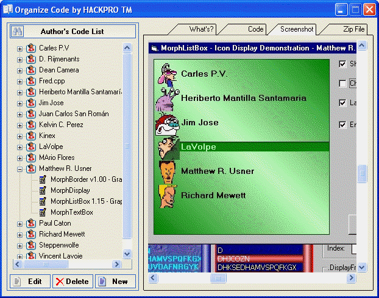



## Organize Code 1\.0 Update 21\-07\-06

### Description

Update: I fixed some bugs thx Mario Villanueva and changed some icons.

Update: I put a new options.

Now:

- You can load a principal info of the readme file of PSC.

- You can search and the PSC website and take the principal data of the post (test version).

- Compact, restore and create backup of Database.

- Load another database in the folder Database.

Thanks to: GetDragon and Territop for the ideas.

This's a Database program, with this program you can organize more better the code of PSC contributor, you can search, add, modify and remove codes.

Please comment any problem with this small program.

You need the Unzip32.dll, you can download in this site: http://home.modemss.brisnet.org.au/~mlevoi/infozip.zip

Credits and Thanks

Alexander Anikin (ASPictureBox Usercontrol)

Genghis Khan (GpTabStrip Usercontrol)

Carles P.V. (ucTreeView Usercontrol)

LaVolpe (Transparent class)

Raymond L. King, Christian Spieler (vbZip File)

[CodeId=24532]

[CodeId=59307]

[CodeId=57047]
 
### More Info
 

             |
---                |---
**Submitted On**   |2006-05-14 22:27:58
**By**             |[Heriberto Mantilla Santamaria](https://github.com/Planet-Source-Code/PSCIndex/blob/master/ByAuthor/heriberto-mantilla-santamaria.md)
**Level**          |Beginner
**User Rating**    |4.9 (108 globes from 22 users)
**Compatibility**  |VB 5\.0, VB 6\.0
**Category**       |[Databases/ Data Access/ DAO/ ADO](https://github.com/Planet-Source-Code/PSCIndex/blob/master/ByCategory/databases-data-access-dao-ado__1-6.md)
**World**          |[Visual Basic](https://github.com/Planet-Source-Code/PSCIndex/blob/master/ByWorld/visual-basic.md)
**Archive File**   |[Organize\_C1996025212006\.zip](https://github.com/Planet-Source-Code/heriberto-mantilla-santamaria-organize-code-1-0-update-21-07-06__1-65202/archive/master.zip)

